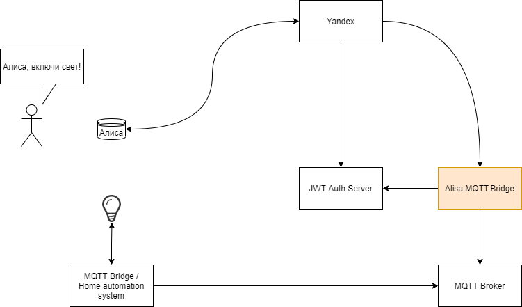
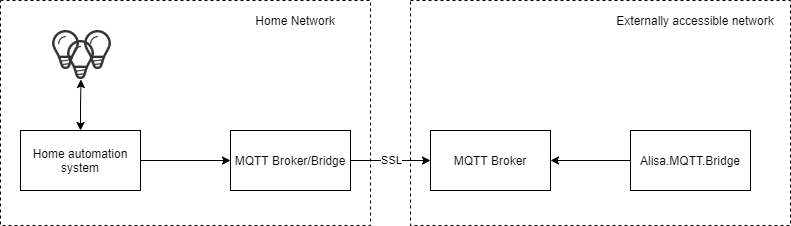
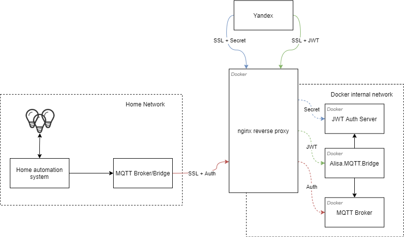

# AlisaSmartHome.MQTT.bridge

This project provides a [smart home REST API](https://yandex.ru/dev/dialogs/alice/doc/smart-home/reference/resources.html) and represents a bridge between your private Yandex-Dialogs-skill and your MQTT broker. 

It allows to control your custom smart-home devices, which are already controllable over MQTT, with simple commands like "Alisa, turn light on", "Alisa, turn off lights in kitchen", "Alisa, raise blinds", "Alisa, turn on fan", etc.



The Project provides a REST API, secured via [OAuth2 JSON Web Tokens](https://oauth.net/2/jwt/), which in turn provides an access to MQTT topics.

For ease setup, the project is also provided as a Docker image: [ai91/alisamqttbridge](https://hub.docker.com/r/ai91/alisamqttbridge).

To enable integration of Alisa into your IoT MQTT, you need to setup following components:
- Install/configure **MQTT Broker**
- Install or use some third-party **JWT Auth Server** 
- Install **Alisa.MQTT.Bridge** *(this project)*
- [Create/setup](https://yandex.ru/dev/dialogs/alice/doc/smart-home/start.html) own **Alisa Smart Home Skill** and add it in DEV mode into your Alisa account

## MQTT Broker and security
As soon as we need to establish communication between your home network, and outer-internets, for security purposes I would recommend to not let connect directly to your internal network with MQTT broker and Home Automation system. 
Though the MQTT configuration is out of scope of this project, I recommend to install a new, external, MQTT broker, and configure your internal one as a [bridge](http://www.steves-internet-guide.com/mosquitto-bridge-configuration/):




Here is an example as I did in my case. I'm hosting a docker infrastructure on VPS:
 


Of course it's up to you how you configure the infrastructure: one can use DynamicDNS and host everything at home network, use no docker, etc.


## Configuration and Alisa.MQTT.Bridge startup
The project is shipped either as a docker image, or as a Spring Boot "fat JAR". Alternatively, of course, it's possible to build and start from sources.

The REST API is served over default Spring Boot port 8080, though can be configured via configuration file, environment variable, or command line. For example see a sample configuration file.

### Docker image
The image: [ai91/alisamqttbridge](https://hub.docker.com/r/ai91/alisamqttbridge) is on hub.docker.

Sample docker-compose config:
```yaml
version: '3.3'

services:

# ....
  alisa_mqtt_bridge:
    container_name: alisa_mqtt_bridge
    image: ai91/alisamqttbridge:latest
    volumes:
      - "./config/:/workspace/config/"
    restart: always
    networks:
# ....
```

The sample `config` directory content can be found [here](config).

### Fat JAR
The application can also be started as a "Spring Boot fat JAR". Downloadable from [releases](https://github.com/ai91/AlisaSmartHome.MQTT.bridge/releases). You need to prepare a JRE 21, and execute following command:

```java -jar alisamqttbridge.jar```

Same [config](config) should be placed in the directory with jar.

### Configuration
#### Basic application properties
The basic configuration is provided in the [config/application.properties](config/application.properties). 

Properties in the file are mandatory, though the file itself is optional: configuration can also be provided as a YAML file, command-line arguments, or as environment variables. 
Details and other options are described in the [Spring Boot documentation](https://docs.spring.io/spring-boot/reference/features/external-config.html).

For example, for troubleshooting, one can lower logging levels with environment variable `LOGGING_LEVEL_ROOT=trace`. 

By default, logging is performed to console. Optionally it's possible to configure logging to external file(s). This can be achieved by modifying `application.properties` according to [following documentation](https://docs.spring.io/spring-boot/reference/features/logging.html). 

#### Alisa Skill devices and rules: devices.json
The basic configuration is responsible for communication and application itself. 

Meanwhile, there is an extended configuration, which describes your smart home configuration, rules, and value mappings between your home automation system and Alisa Smart Home Skill. 
The extended configuration takes place in the [config/devices.json](config/devices.json).

The **devices.json** configuration is a bit sophisticated, therefore I provide it in the dedicated [document](config/)

# Building
## Docker
```
cd alisamqttbridge

gradlew bootBuildImage --imageName=ai91/alisamqttbridge:1.0

docker push ai91/alisamqttbridge:1.0
```
## Spring Boot Fat-JAR
```
cd alisamqttbridge

gradlew build
```
Resulting jar will be located at `alisamqttbridge\build\libs\`

# Credits
The project idea and *devices.json* rules/mappings were inspired by similar project [HomeAutio.Mqtt.GoogleHome](https://github.com/i8beef/HomeAutio.Mqtt.GoogleHome)

[](https://youtu.be/2UMcK2p4e1I)
[](https://youtu.be/p6C_MBKraxY)
