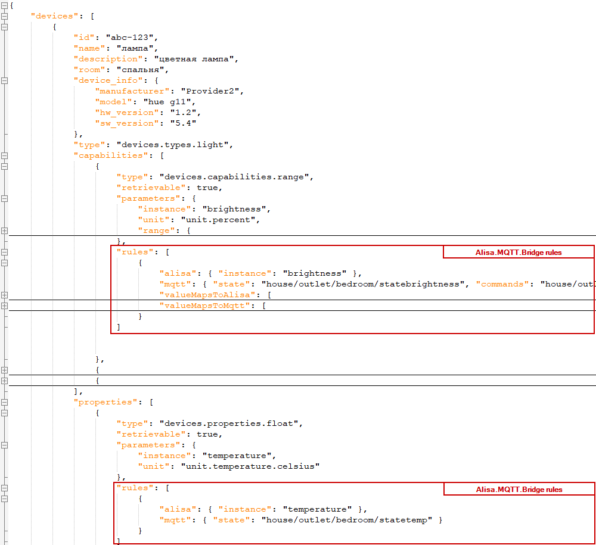

# Directory with sample config

## application.properties
The `application.properties` contains basic configuration. Properties themself are self-explaining, I believe.

## devices.json
The `devices.json` is more complex. It describes your smart home configuration, rules, and value mappings between your home automation system and Alisa Smart Home Skill.

The basic structure is following: there is a `devices` node on the root level, which contains an array of devices in your household, as they must be reported by [get devices request](https://yandex.ru/dev/dialogs/alice/doc/smart-home/reference/get-devices.html), with additional `rules` node under each `capability` and `property`: 

The `devices` node will be sent on `/v1.0/user/devices` requests, omitting `rules` nodes. For more details on how to describe different device types, their capabilities and properties, please see the [official documentation](https://yandex.ru/dev/dialogs/alice/doc/smart-home/concepts/device-types.html): 

### Alisa.MQTT.Bridge rules definitions
This part is an array of rules and mappings for [devices/query](https://yandex.ru/dev/dialogs/alice/doc/smart-home/reference/post-devices-query.html) and for [devices/action](https://yandex.ru/dev/dialogs/alice/doc/smart-home/reference/post-action.html) requests.

Each `rule` object may contain following nodes:
- `alisa` - are properties for communication with Alisa API's
- `mqtt` - are properties for communication with MQTT topics
- `valueMapsToAlisa` - mapping rules, when it's necessary to convert a value received from MQTT topic, before provide to Alisa within `devices/query`
- `valueMapsToMqtt` - mapping rules, when it's necessary to convert a value received from `devices/action` before publish to MQTT

#### rule.alexa
This node may contain following nodes:
- `alisa.instance` - is an Alisa controller instance under `state` node.
- `alisa.subvalue` - when reporting state to Alisa, the `state` should be a complex node, rather than a simple value. It defines a subnode name under `state` for providing state. For example for `devices.capabilities.color_setting` with `color_model`=`hsv`, the expected report value must be like that:

```json
...
"state": {
    "instance": "hsv",
    "value": {
        "h": 255,
        "s": 50,
        "v": 100
    }
}
...
```

to achieve that, it's necessary to define 3 rules, one per subvalue:

```json
{
    "type": "devices.capabilities.color_setting",
    "parameters": {
        "color_model": "hsv",
        "temperature_k": { "min": 2700, "max": 9000, "precision": 1 }
    },
   "rules": [
     {
        "alisa": { "instance": "hsv", "subvalue": "h" },
        "mqtt": { "state": "house/outlet/bedroom/statecolor" },
        "valueMapsToAlisa": [ { "type": "regex", "search": "^([0-9]+),([0-9]+),([0-9]+)$",  "replace": "$1" } ]
     },
     {
        "alisa": { "instance": "hsv", "subvalue": "s" },
        "mqtt": { "state": "house/outlet/bedroom/statecolor" },
        "valueMapsToAlisa": [ { "type": "regex", "search": "^([0-9]+),([0-9]+),([0-9]+)$",  "replace": "$2" } ]
     },
     {
        "alisa": { "instance": "hsv", "subvalue": "v" },
        "mqtt": { "state": "house/outlet/bedroom/statecolor" },
        "valueMapsToAlisa": [ { "type": "regex", "search": "^([0-9]+),([0-9]+),([0-9]+)$",  "replace": "$3" } ]
     },
     {
        "alisa": { "instance": "hsv" },
        "mqtt": { "commands": "house/outlet/bedroom/commandcolor" },
        "valueMapsToMqtt": [ 
           { "type": "template", "template": "${h},${s},${v}" }
        ]
     }
  ]
}
```

#### rule.mqtt
This node may contain following nodes:
- `mqtt.state` - topic name with values received from Home Automation System. Used as a value-source for `devices/query` responses.
- `mqtt.commands` - topic name for commands to be sent to Home Automation System. Used as target-topic for `devices/action` commands received from Alexa.

#### rule.valueMapsToAlisa and rule.valueMapsToMqtt
They are arrays with value-mappings for converting values from MQTT topics to Alisa and back.

Each mapping node has a structure predefined by it's `type`.

Following types are supported:

<table>
<tr><th>Type</th><th>Structure</th><th>Description</th></tr>
<tr><td><code>static</code></td><td>

```json
{ 
  "type": "static", 
  "value": "1" 
}
```

</td>
<td>Provides a constant predefined value. </td></tr>

<tr><td><code>value</code></td><td>

```json
{ 
  "type": "value", 
  "from": "1", "to": "true" 
 }
 ```

</td>
<td>Makes a simple conversion when input value matches to `from` field. </td></tr>

<tr><td><code>linearRange</code></td><td>

```json
{ 
  "type": "linearRange", 
  "fromMin": 12, "fromMax": 0, 
  "toMin": 0, "toMax": 100, 
  "rounded": true 
}
```

</td>
<td>Converts integer and float ranges.</td></tr>


<tr><td><code>regex</code></td><td>

```json
{ 
  "type": "regex", 
  "search": "^cmd([0-4]+)$", "replace": "mva$1" 
}
```

</td>
<td>Regular expressions.</td></tr>

<tr><td><code>formula</code></td><td>

```json
{ 
  "type": "formula", 
  "formula": "(value-32)*5/9", 
  "rounded": true 
}
```

</td>
<td>Performs calculation according to formula. Variables can be either <code>value</code> for simple inputs, or any other name, when input value is a complex object. For example when recevied a command for color_setting adjustment, the input object looks like that:

```json
...
"state": {
    "instance": "hsv",
    "value": {
        "h": 255,
        "s": 50,
        "v": 100
    }
}
...
```

in this case, one can use <code>h</code>, <code>s</code>, and <code>v</code> as formula variables:

```json
{ 
  "type": "formula", 
  "formula": "(h-32)*5/9 + 256*(s-32)*5/9 + 65535*(v-32)*5/9", 
  "rounded": true 
}
```

  <br> Supported expressions can be found at https://www.objecthunter.net/exp4j/ </td></tr>
  
<tr><td><code>template</code></td><td>

```json
{ 
  "type": "template", 
  "template": "(${h},${s},${v})" 
}
```

</td>
<td>Template with named placeholders, wrapped into ${name}. Same as <code>formula</code>, names can be either <code>${value}</code>, or any other value-subnode-name, like <code>${h}</code>, <code>${s}</code>, <code>${v}</code>, etc. </td></tr>
  
</table>

When rule contains multiple mappings, they are attempted to be applied in order from first to last. If some mapping can't be applied (for example `value` mapping doesn't match `from` field), then this mapping is skipped, and verified next one. Iteration stopped after first successful conversion.    

# Troubleshooting
Potential misconfigurations may cause either stop of the whole application, or some devices or rules may be ignored.

It's recommended to review application logs after initial setup to locate potential issues: 

```
docker logs alisa_mqtt_bridge
```